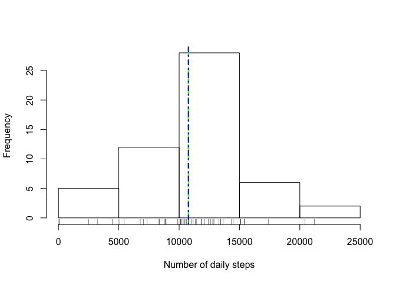
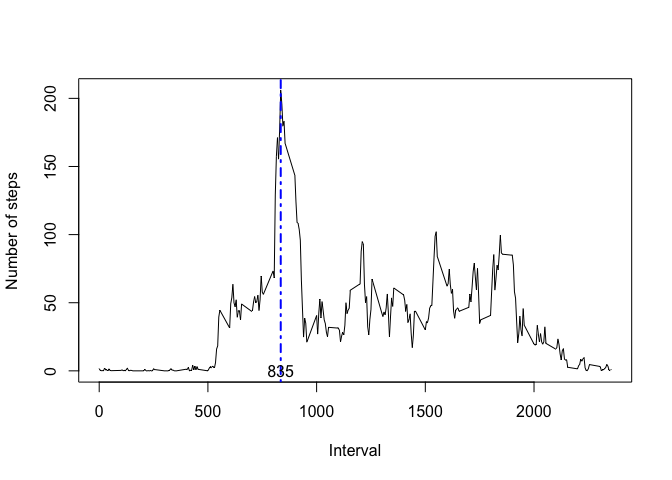
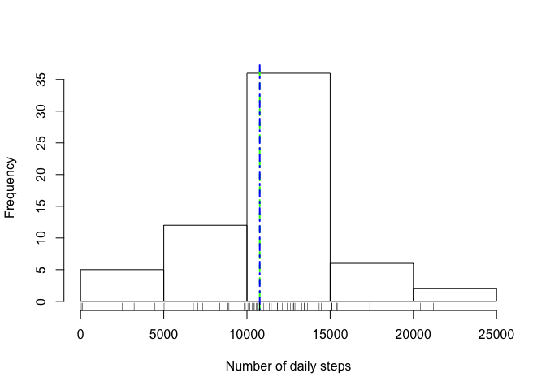

# Reproducible Research: Peer Assessment 1


## Loading and preprocessing the data

```r
activity_df <- read.csv(unzip("activity.zip", "activity.csv"))
```


## What is mean total number of steps taken per day?

```r
total_steps_per_day <- with(activity_df, tapply(steps, date, sum))
mean(total_steps_per_day, na.rm = TRUE)
```

```
## [1] 10766.19
```

```r
hist(total_steps_per_day, xlab = "Number of daily steps", main = "")
abline(v = median(total_steps_per_day, na.rm = TRUE), col = "green", lwd = 2, lty = 2)
abline(v = mean(total_steps_per_day, na.rm = TRUE), col = "blue", lwd = 2, lty = 4)
rug(total_steps_per_day)
```

 


## What is the average daily activity pattern?

```r
total_steps_per_day <- with(activity_df, tapply(steps, interval, mean, na.rm = TRUE, simplify = TRUE))
plot(row.names(total_steps_per_day), total_steps_per_day, type = 'l', ylab= "Number of steps", xlab="Interval")
max_steps = max(total_steps_per_day)
max_num_step_interval = names(total_steps_per_day[total_steps_per_day == max_steps])
abline(v = max_num_step_interval, col = "blue", lwd = 2, lty = 4)
text(y = 0, x = max_num_step_interval, labels = max_num_step_interval)
```

 


## Imputing missing values

```r
number_of_nas <- length(activity_df$steps[is.na(activity_df$steps)])
number_of_nas
```

```
## [1] 2304
```

```r
avg_num_steps <- mean(activity_df$steps, na.rm = TRUE)
activity_df_no_nas <- data.frame(steps = activity_df$steps, date = activity_df$date, activity_df$interval)
activity_df_no_nas$steps[is.na(activity_df_no_nas$steps) == TRUE] = avg_num_steps

total_steps_per_day_no_nas <- with(activity_df_no_nas, tapply(steps, date, sum))
mean_no_nas = mean(total_steps_per_day_no_nas)
mean_no_nas
```

```
## [1] 10766.19
```

```r
hist(total_steps_per_day_no_nas, xlab = "Number of daily steps", main = "")
abline(v = median(total_steps_per_day_no_nas), col = "green", lwd = 2, lty = 2)
abline(v = mean(total_steps_per_day_no_nas), col = "blue", lwd = 2, lty = 4)
rug(total_steps_per_day_no_nas)
```

 


## Are there differences in activity patterns between weekdays and weekends?

